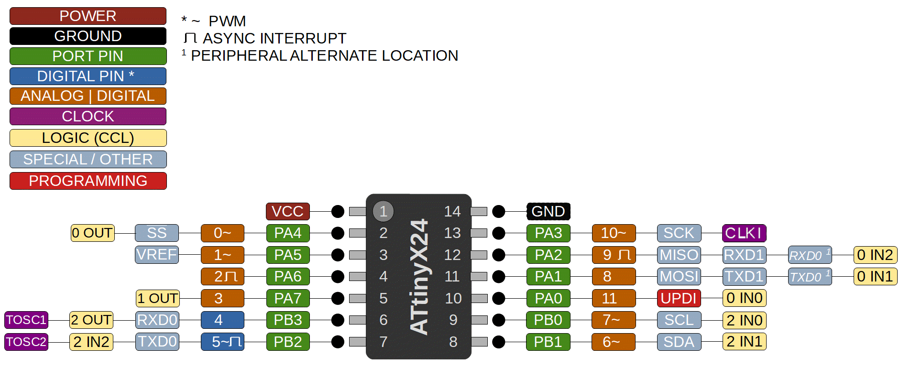

### ATtiny 424/824/1624/3224

 Specifications |  ATtiny424|  ATtiny824  |  ATtiny1624  |    ATtiny3224
------------ | ------------- | ------------- | ------------- | -------------
Flash (program memory)   | 4096 bytes | 8192 bytes | 16384 bytes | 32768 bytes
Flash w/Optiboot   | 3584 bytes | 7680 bytes | 15872 bytes | 32256 bytes
RAM  | 512 bytes | 1024 bytes | 2048 bytes | 3072 bytes
EEPROM | 128 bytes | 128 bytes | 256 bytes | 256 bytes
Bootloader | Optiboot (optional, not recommended) | Optiboot (optional, not recommended)| Optiboot (optional, not recommended) | Optiboot (optional, not recommended)

Feature   | Specification  |
----------|----------------|
GPIO Pins | 12 (11 usable) |
ADC       | 12-bit, differential w/PGA |
ADC Channels | 9, 7 can be neg. diff. pin. |
DAC | Internal for AC ref only| 
Comparator | 1 |
PWM Channels | 6 |
Timer Type B | 2 |
Timer Type D | No |
Interfaces | UART (2), SPI, I2C |
Clock options | Internal 20/16/10/8/5/4/1 MHz |
RTC crystal   | Optional, TOSC1, TOSC2 |
Package | SOIC-14, SSOP-14 |

The smallest pincount of the tinyAVR 2-series parts. These have been announced in the full range of flash size options - Hopefully it won't be a repeat of the 3214 which was in the ATpacks, but never actually shipped, and had all references to it removed. Notice that some 1-series features - mostly the extravagances of the "golden" 1-series parts - are gone, while the second type B timer (thankfully) in all sizes. The main features though are the fancy ADC, and the second USART - as well as a 32k version with 3k SRAM, and the expanded RAM on the 4k and 8k parts, making them a lot more practical. 

Unlike the higher pincount devices, you can't have alt reset here (the pin it can be moved to doesn't exist here), so these have the same reset-pain as the 1-series. 

The super ADC can accumulate 1024 samples in a single burst read; decimation of the accumulated value so all of the digits are meaningful can give up to 17-bits of accuracy. For advanced ADC functionality, several new functions are provided, see ADC section of the main readme for more information.

### Buy official megaTinyCore breakouts and support continued development!
TBD

### Datasheets and Errata
See [Datasheet Listing](Datasheets.md)
